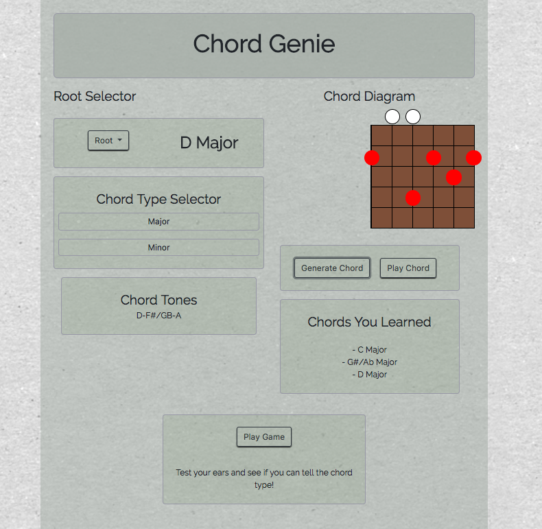

# Chord Genie
> Application capable of teaching a user guitar chords and a game test your ears

Chord Genie is a JavaScript program for the beginner guitarist who wants to learn to play and hear chords. Users can:

* Select chord
* See all individual notes in a chord
* Hear the chord on the diagram
* Train your ears with a guess the chord game

> [Demo Here](https://chordgenie.surge.sh)

## Installation

Clone this repository and open `index.html` with Chrome

## Next Steps

- [ ] Clean up and add content to the Chord Diagram
- [ ] Update Style Guide
- [ ] Add a scale diagram page
